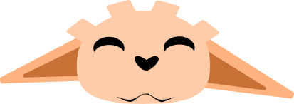

# Godot Haxi Tools

## What is that?
* Small framework for Godot
* Allows to develop Games a little faster
* Made by `HaxiDenti` for developing Games faster
* Contains small ecosystem

## Documentation
* Documentation is inside `addons/GodotHaxi/doc/README.md`
* [Documentation Link](addons/GodotHaxi/doc/README.md)

## Install
* Just copy `addons/GodotHaxi` into your project. (Remove old if there was one)